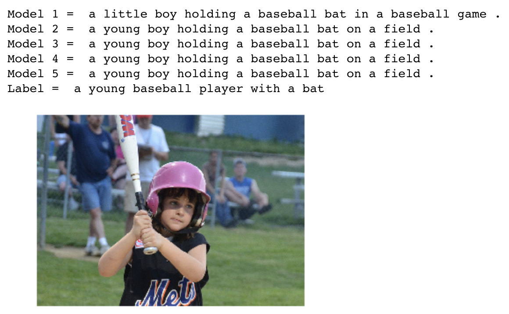

# Image captioning and retreival
This repository has the code needed to build image captioning networks that can be used as a backbone to design an 
Image retrieval system. This system can recommends images similar to an input image from a dataset. Similarity is measured using Jaccard similarity metric which uses captions (high level text representation of the image). The image retreival system uses COCO 2014 training and validation datasets and our own dataset scraped from Google Images (Proof of concept), from which the images are recommended.

The original code for image captioning entwork was taken from following the repository [pytorch-tutorial/image-captioning](https://github.com/yunjey/pytorch-tutorial/blob/master/tutorials/03-advanced/image_captioning/README.md)

The code obtained from the above repository was tweeked to generate multiple encoder-decoder models. All pretrained models and data can be accessed from [this link ](https://drive.google.com/drive/folders/1PsAwLMprM7lnWdrzq1PkQVP40A-a8d3s?ogsrc=32)

#### Models explored
##### Model1
This model was pretrained (by authors of the above mentioned repository). The encoder architecture is Resnet 152, decoder architecture was single layer LSTM with 512 dimensional hidden states. Each word is represented using 256 dimensional learnable embedding.
##### Model2
The encoder architecture is Resnet 101, decoder architecture is a single layer LSTM with 512 dimensional hidden states. Each word is represented using 256 dimensional learnable embedding.
##### Model3
The encoder architecture is Resnet 152, decoder architecture is a single layer LSTM with 256 dimensional hidden states. Each word is represented using 128 dimensional learnable embedding.
##### Model4
The encoder architecture is Resnet 101, decoder architecture is a double layer LSTM with 512 dimensional hidden states for both layers. Each word is represented using 256 dimensional learnable embedding.
##### Model5
The encoder architecture is Resnet 101, decoder architecture is a single layer LSTM with 512 dimensional hidden states for both layers. Each word is represented using 300 dimensional Glove Vectors which was kept fixed throughout training.

## Results

## Usage

#### 1. Install pycocotools

pip install pycocotools
     
#### 2. Clone repository

git clone https://github.com/JoseJoy249/Image_captioning_and_retrieval.git

#### 3. Download COCO 2014 training and validation datasets

      pip install -r requirements.txt 
      chmod +x download.sh
      ./download.sh
    
move the all files to /data

#### 4. Create Google image dataset (if needed) 
Run image_crapper.ipynb to download images and captions. To download images of a specific context, change seach queries in the  taret_queries.txt file. 

#### 5. Download pretrained models
Pretrained models and other data can be downloaded from [this link ](https://drive.google.com/drive/folders/1PsAwLMprM7lnWdrzq1PkQVP40A-a8d3s?ogsrc=32). Trained models have to be moved to ./models. Vocabulary file and weight matirx to ./data

#### 5. Run image_retrieval_system.ipynb

